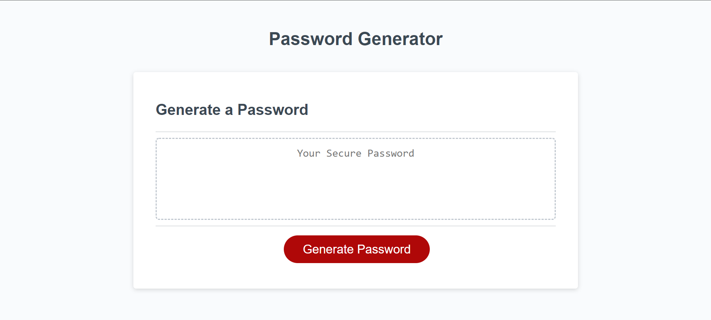

# Secure-Password

## About the page

This is a simple page that produces randomly generated passwords based on the user input critera asked via popup boxes.

The purpose of this page is simple, take the input from a user to determine how to structure the password to ensure a safe and secure password the user could use without the worry of it being compromised.

 

## The code set-up

The code is set up to ask the user critera by asking for a yes or no responses with confirm boxes. The true and flase values are then used to see if an array is needed to concat to an empty array, when the array is concated it combines both arrays into one and create one really long array. That is when i for loop runs through a math.random code to pull random items from the array, the then scambled and random password is generated.

## Webpage screenshot

## webpage link
[link to active page](https://brycebann.github.io/Secure-Password/)